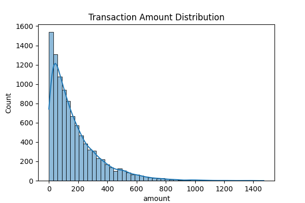
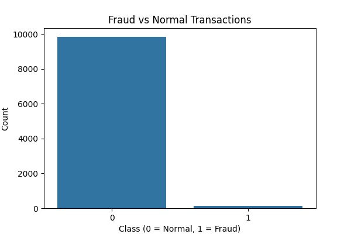
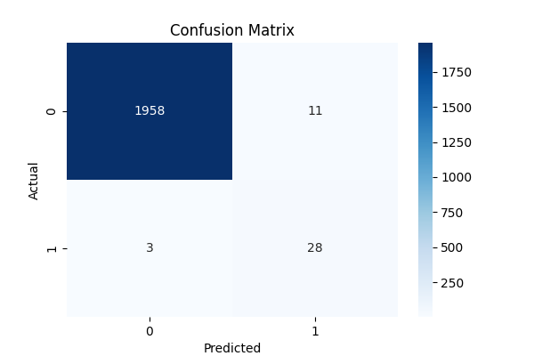
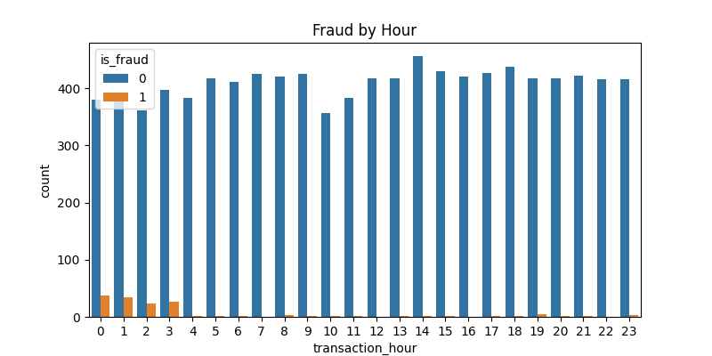
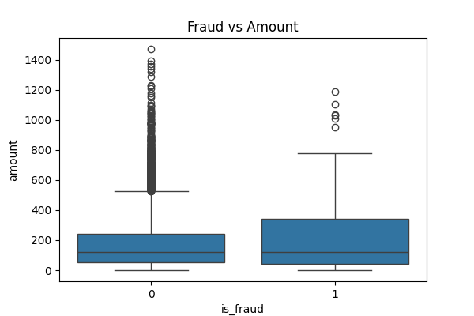
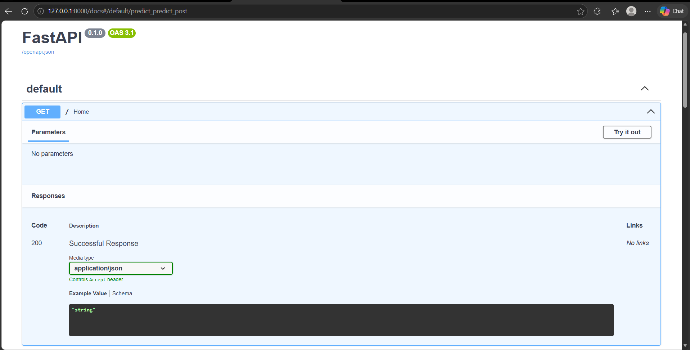
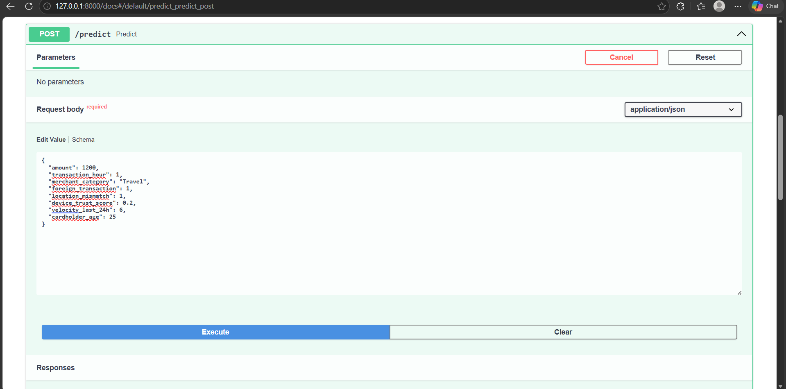
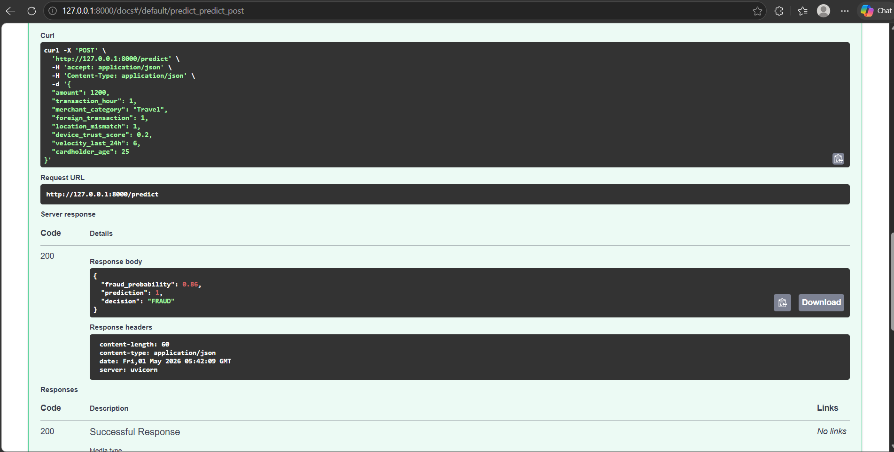

# 💳 Credit Card Fraud Detection System

## 📌 Project Overview

This project is a **Machine Learning-based Credit Card Fraud Detection System** that identifies fraudulent transactions using classification algorithms.

It includes:

* Data preprocessing & visualization (EDA)
* Handling imbalanced data using SMOTE
* Model training & evaluation
* REST API using FastAPI for real-time predictions

 ## ❗ Problem Statement

Credit card fraud is a major issue in digital payments, where fraudulent transactions are very rare compared to genuine ones. This creates a highly imbalanced dataset, making detection challenging.
The goal of this project is to accurately detect fraudulent transactions while minimizing false negatives (missed fraud cases).

---

## 🚀 Features

* 📊 Exploratory Data Analysis (EDA)
* ⚖️ Handles imbalanced dataset using SMOTE
* 🤖 Machine Learning model (Random Forest)
* 📈 Evaluation using precision, recall, F1-score
* 🌐 FastAPI deployment for real-time prediction
* 💾 Model saving using pickle

## 🔄 Project Workflow

1. Data Collection  
2. Data Preprocessing  
3. Exploratory Data Analysis (EDA)  
4. Handling Imbalanced Data (SMOTE)  
5. Model Training (Random Forest)  
6. Model Evaluation  
7. Model Deployment using FastAPI  

## ⚙️ How It Works

- The system takes transaction details as input  
- The trained machine learning model predicts fraud probability  
- A decision threshold is applied to classify transactions  
- The API returns:
  - Fraud probability
  - Prediction (0 or 1)
  - Decision (FRAUD / NOT FRAUD)


---

## 📸 Project Screenshots

### 📊 Transaction Amount Distribution


### ⚖️ Class Distribution


### 🧠 Confusion Matrix


### ⏱️ Fraud by Hour


### 💰 Fraud vs Amount


---

### 🌐 API Home (FastAPI)


### 📥 API Request (Swagger UI)


### 🔍 Prediction Output


## 🗂️ Project Structure

```
Credit-Card-Fraud-Detection/
│
├── data/
│   └── creditcard.csv
│
├── models/
│   └── fraud_model.pkl
│
├── outputs/
│   ├── amount_distribution.png
│   ├── class_distribution.png
│   ├── confusion_matrix.png
│   ├── fraud_by_hour.png
│   └── fraud_vs_amount.png
│
├── images/                # Screenshots for README
│   ├── get.png
│   ├── post.png
│   └── post1.png
│
├── app.py                 # FastAPI app
├── main.py                # Model training script
│
├── requirements.txt
├── README.md
├── .gitignore
```

---

## ⚙️ Installation

### 1️⃣ Clone the repository

```
git clone https://github.com/your-username/credit-card-fraud-detection.git
cd credit-card-fraud-detection
```

### 2️⃣ Create virtual environment

```
python -m venv venv
venv\Scripts\activate
```

### 3️⃣ Install dependencies

```
pip install -r requirements.txt
```

---

## ▶️ Run the Project

### 🔹 Step 1: Train Model

```
python main.py
```

✔ This will:

* Load dataset
* Perform preprocessing
* Train model
* Save model as `fraud_model.pkl`

---

### 🔹 Step 2: Run API

```
uvicorn app:app --reload
```

Open browser:

```
http://127.0.0.1:8000/docs
```

---

## 🔍 API Usage

### Endpoint:

```
POST /predict
```

### Sample Input:

```json
{
  "amount": 1200,
  "transaction_hour": 1,
  "merchant_category": "Travel",
  "foreign_transaction": 1,
  "location_mismatch": 1,
  "device_trust_score": 0.2,
  "velocity_last_24h": 6,
  "cardholder_age": 25
}
```

### Sample Output:

```json
{
  "fraud_probability": 0.86,
  "prediction": 1,
  "decision": "FRAUD"
}
```

---

## 📊 Model Performance

* Accuracy: ~99%
* High Recall for Fraud Detection
* Confusion Matrix:

  * True Positives: 28
  * False Negatives: 3

---

## 🛠️ Technologies Used

* Python
* Pandas
* NumPy
* Scikit-learn
* Matplotlib & Seaborn
* FastAPI
* Uvicorn
* imbalanced-learn (SMOTE)

---

## 📌 Key Learnings

* Handling imbalanced datasets
* Feature encoding
* Model evaluation metrics
* API deployment with FastAPI

---

## 📎 Future Improvements

* Add Streamlit Dashboard
* Deploy on cloud (AWS/Render)
* Use advanced models (XGBoost, Neural Networks)
* Real-time fraud monitoring system

---

## 👩‍💻 Author

Swetha K

---
